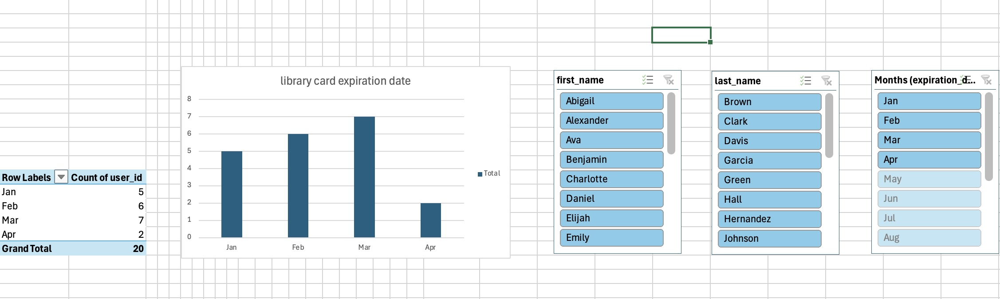

# Library Database 

### GOAL

- create a library databse 
- create a view
- create pivot table & chart on VIEW table

## ER DIAGRAM

- **This diagram represents 6 entities, 1 of them being a join table for a many to many relationship** 

- **The book_author table serves as a join table between books and author in the case that a book has multiple authors**

## SQL script

- **For the sql code, I entered all of the data from my ER Diagram and ensured that the tables with foreigns keys were created after the table they reference**

DROP TABLE IF EXISTS library.book_author;  
DROP TABLE IF EXISTS library.loans;  
DROP TABLE IF EXISTS library.books;  
DROP TABLE IF EXISTS library.author;  
DROP TABLE IF EXISTS library.library_card;  
DROP TABLE IF EXISTS library.user;  

CREATE TABLE library.user (  
    user_id SERIAL UNIQUE PRIMARY KEY,  
    first_name VARCHAR(255),  
    last_name VARCHAR(255),  
    email VARCHAR(255),  
    phone VARCHAR(255),  
    user_address VARCHAR(255),  
    username VARCHAR(255),  
    user_password VARCHAR(255)
); 

CREATE TABLE library.library_card (  
    card_id SERIAL UNIQUE PRIMARY KEY,  
    user_id INT UNIQUE,  
    issue_date DATE,  
    expiration_date DATE,
    FOREIGN KEY (user_id) REFERENCES library.user(user_id)  
); 

CREATE TABLE library.books(  
    book_id SERIAL PRIMARY KEY,  
    book_name VARCHAR(255),  
    book_genre VARCHAR(255),  
    available BOOLEAN  
);  
CREATE TABLE library.loans(  
    checkout_id VARCHAR(255) PRIMARY KEY,  
    available BOOLEAN,  
    first_name VARCHAR(255),  
    book_id INT,  
    takeout_date DATE,  
    due_date DATE,  
    FOREIGN KEY (book_id) REFERENCES library.books (book_id)  
); 

CREATE TABLE library.author(  
    author_name VARCHAR(255) PRIMARY KEY,  
    award VARCHAR(255)  
);  

CREATE TABLE library.book_author(  
    book_id INT,  
    author_name VARCHAR(255),  
    PRIMARY KEY (book_id, author_name),  
    FOREIGN KEY (book_id) REFERENCES library.books(book_id) ON DELETE CASCADE,  
    FOREIGN KEY (author_name) REFERENCES library.author (author_name)  
);  

## insert into statements

- **mock data**

INSERT INTO library.user (user_id, first_name, last_name, email, phone, user_address, username, user_password) VALUES (1, 'Charlotte', 'Thompson', 'charlotte.thompson@example.com', '100-200-3000', '101 Cherry Lane, Springfield, IL', 'charlotte', 'hashed_password_1');  
  
INSERT INTO library.library_card (card_id, user_id, issue_date, expiration_date) VALUES (1, 1, '01/12/2023', '01/12/2026');  

INSERT INTO library.books (book_id, book_name, book_genre, available) VALUES (1, 'Dreams of Tomorrow', 'Self-Help', false);  

insert into library.loans (checkout_id, available, first_name, book_id, takeout_date, due_date) values ( 'CDEF9012', false, 'Charlotte', 1, '11/3/2024', '9/10/2024');

INSERT INTO library.author (author_name, award) VALUES ('Tony Stark', 'Best Fiction Award');  

INSERT INTO library.book_author (book_id, author_name) VALUES (1, 'Brian Brown');  

## VIEW

***This view joins the library_card table and the user table creating a new table that shows a users name and when their card was issued and expires.***

CREATE VIEW user_card_exp AS

SELECT lc.card_id, lc.user_id, u.first_name, u.last_name, lc.issue_date, lc.expiration_date

FROM library.library_card lc

JOIN library.user u ON lc.card_id = u,user_id;

**View table in terminal**

## Python script

- **This python script connects to my library databse and uses pandas import my view into an excel document**

- **I can use PowerQuery to acess this document and make visualizations in excel**

db_name = "mvargas"
user = "mvargas"
host = "dbserver.gctaa.net"
port = "5432"

connection_string = f"postgresql+psycopg://{user}:{password}@{host}:{port}/{db_name}"

engine = create_engine(connection_string)

query = "select * from user_card_exp;"
df = pd.read_sql_query(query, engine)

df.to_excel("output.xlsx", index=False)

## Excel

- **View table**

- **The purpose of the pivot table is to see how many lirary cards are set to expire in the year 2026, filtered by month**

- **The slicers allow you to see the names of the users who's library cards will expire in what month**

