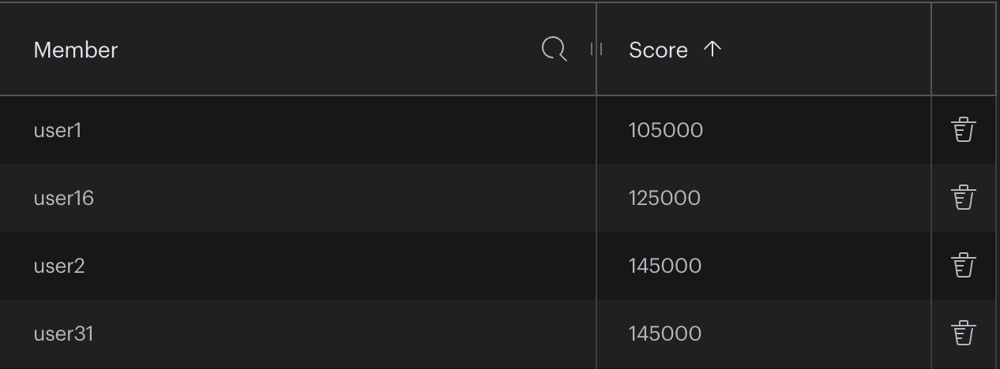

### What is Redis?
- Redis is an in memory NOSQL database that is widely used due to its ability to receive tons of data very quickly
- Redis is able to handle so much input because it stores it all on RAM, not using the disk at all
- Because all data is stored in RAM, the data is much faster to retrieve, but also less secure 

### How it works
- Redis relies on the RAM for fast access and storage of data
- Due to the many types of ways Redis can store data, it is commonly used to input tons of different data types into one singular database
- Redis supports many types of database types including

##### Ordered
- Sorted Sets

- Lists

##### Not Ordered

- Json

- HASH

### Compared to Postgress
- Postgress supports much more complicated queries and joins
- Redis supports faster data integration and accessibility 

### When to use
- Use Redis when you need fast data storage and real time data proccesing 
- Use Postgress for larger and more secure databases with complex relationships

### Types of projects to consider for Redis

- Live sport scores
- tournament leaderboards

- Projects that would benefit from caching 
- Projects that would need high speed aggregation of data
- Projects that wouldn't store data long term

### Demo
